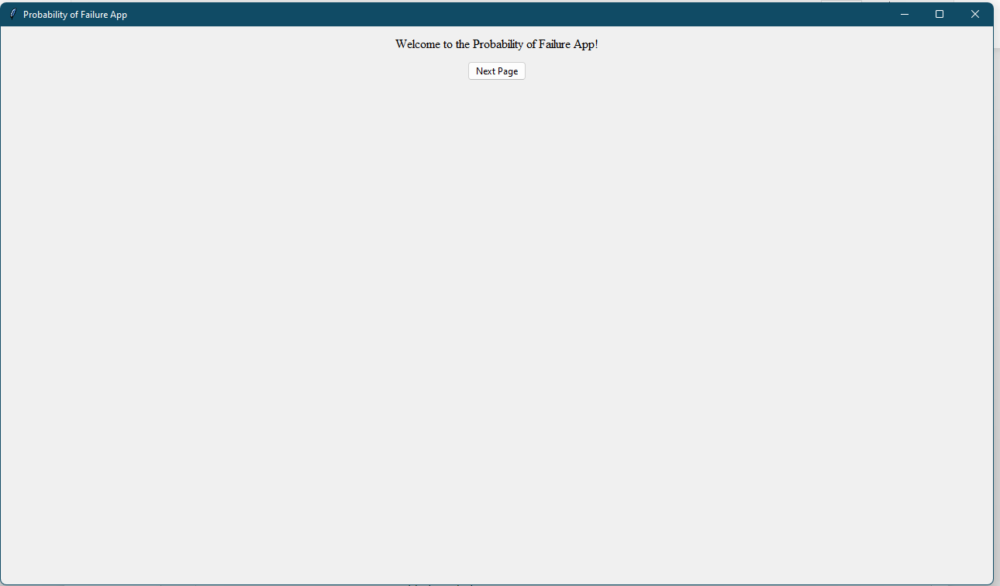
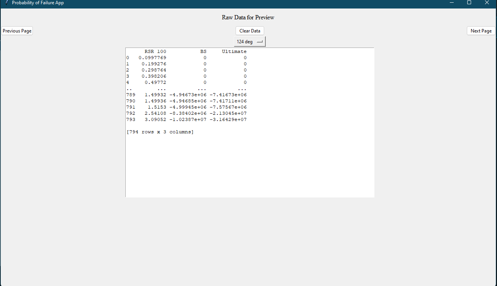
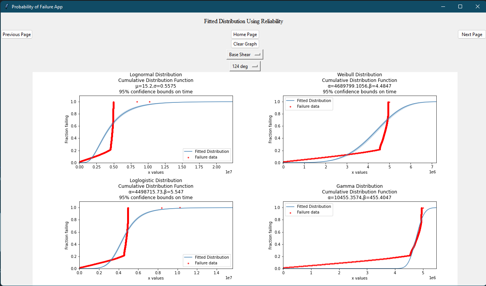
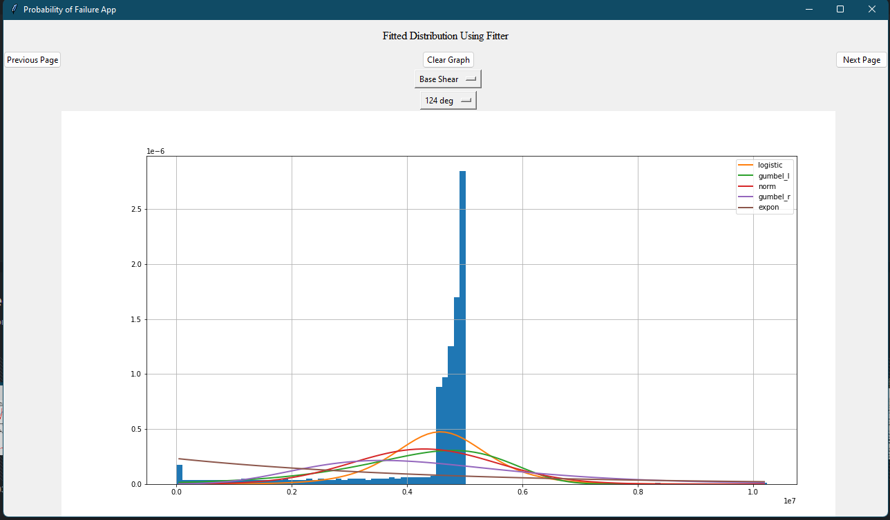
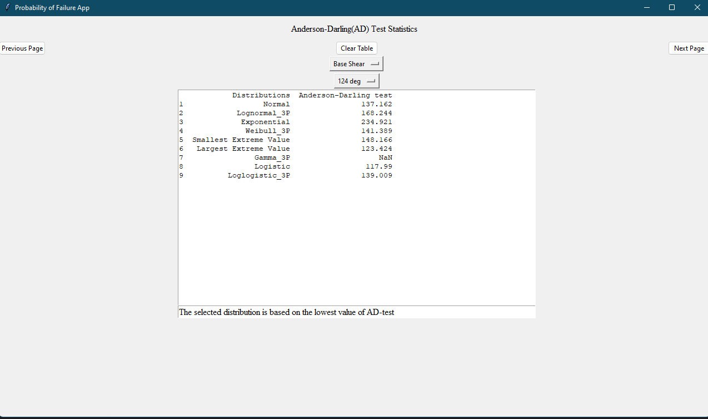
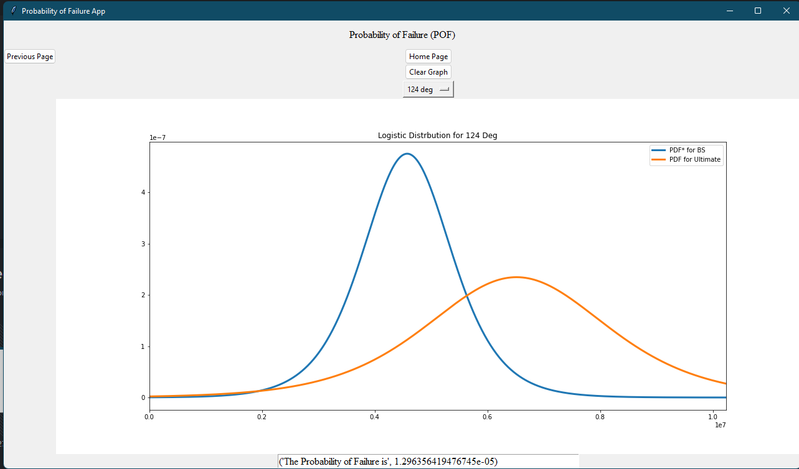

# POF App
An app that show the fitted distribution of a certain data and the probability of failure. 

# About
* This app is only viable if you have the source file. If you are interested to know how the 
  app works, please feel free to contact me: isaac.ong1098@gmail.com
 
* It is created using Jupyter Notebook(Python3). All the required package is available 
  in the source code.
  
* Main Objective of this project is to create a **user interface** for the **probability of failure
  app**. Hence, **tkinter** is selected due to its ability to create graphical user interface(GUI).

* This is used to calculate the probability of failure (POF) for offshore structures. The data is 
  provided by industrial supervisor.

# Start Page of the App
Here is a preview of the start page of the app developed using **tkinter.**

# First Page of the App
The first page of the App will show the user the data that has been extracted from Excel and 
displayed in table form using **pandas**.

# Second Page of the App 
The second page of the App will plot the graph using **reliability** and **fitter**. The purpose
of using two library here is due the limitation in Python to plot 3-parameter distributions. 
**Reliability** is used to plot 3-parameter distributions while **fitter** is used to plot the 
remaining distributions.

# Third Page of the App 
The third page of the App will plot the graph using **fitter** as mentioned above. 

# Fourth Page of the App 
The fourth page of the App will show the statistical test to determine the suitable distribution to 
be used to calculate the probability of failure. 

# Fifth Page of the App
The fifth and final page of the App will display the result of the selected distribution based on the 
statistical test performed previously. 

### That is all for the App. Any inquiries feel free to contact me via:
* email: isaac.ong1098@gmail.com
* linkedin: https://www.linkedin.com/in/ong-kang-chiew-2423b520b/
